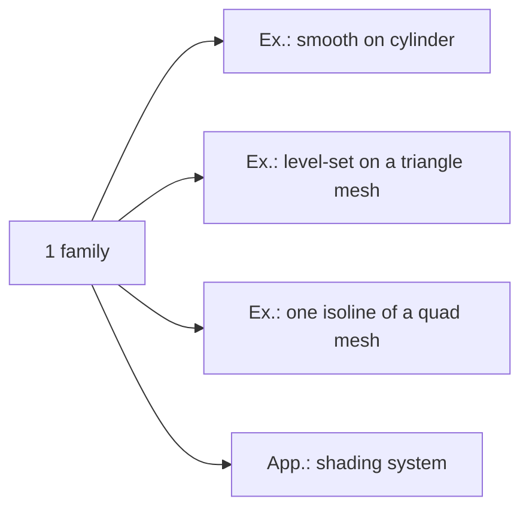
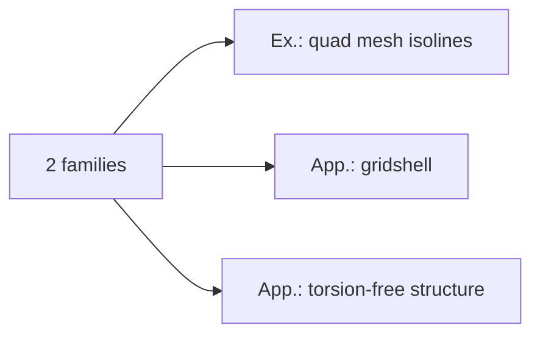
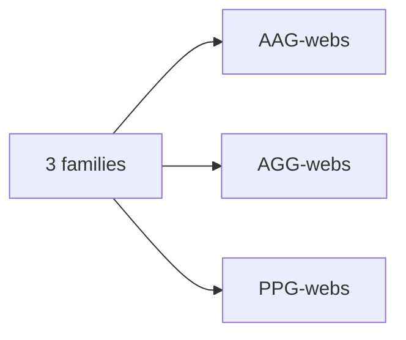

------
##### <i class='fas fa-folder-open'>**Publication**</i> 
ACM Transactions on Graphics; 
Accepted by the **SIGGRAPH Asia 2023** conference (Dec.12-15, Sydney, Australia).

##### <i class='fas fa-laugh-beam'>**Authors**</i> 
Bolun Wang, Hui Wang, Eike Schling, Helmut Pottmann

##### <i class='fas fa-align-justify'>**Abstract**</i>
Straight flat strips of inextensible material can be bent into curved strips aligned with arbitrary space curves. The large shape variety of these socalled rectifying strips makes them candidates for shape modeling, especially in applications such as architecture where simple elements are preferred for the fabrication of complex shapes. In this paper, we provide computational tools for the design of shapes from rectifying strips. They can form various patterns and fulfill constraints which are required for specific applications such as gridshells or shading systems. The methodology is based on discrete models of rectifying strips, a discrete level-set formulation and optimization-based constrained mesh design and editing. We also analyse the geometry at nodes and present remarkable quadrilateral arrangements of rectifying strips with torsion-free nodes.

##### <i class='fas fa-file-pdf'>**PDF**</i>
[paper](/assets/pdf/2023SIGA.pdf)

<iframe src="/assets/pdf/2023SIGA.pdf#toolbar=0" 
width="100%" height=400 frameborder="0" style="border: none;">
</iframe>

------

##### <i class='far fa-images'>**Figures**</i>

    

        
    

    

        
    

    A smooth pseugo-geodesic on a rotational cylinder.

    

        
    

    

        
    

    A family of pseudo-geodesics on a mesh. Left: A family of pseudo-geodesic of tilt angle $60^o$ as level-sets are constructed from a triangle mesh. Right: A family of pseudo-geodesics of angle $45^o$ are optimized from geodesics of the quad mesh.

    

        
    

    

        
    

    Shading facade with time changing from morning to after. Left: outside. Right: inside view with focal lenth=10.

    

        
    

    

        
    

    

        
    

    Four shading facades. Left: shading effect with changing light directions at different time. Center-Right: turn-table views.

    

        
    

    

        
    

    Pseudo-geodesic gridshells. Right: torsion-free rectifying strip structures.

    

        
    

    AAG-web.

    

        
    

    AGG-web.

    

        
    

    PPG-web.

------

#### <i class='fas fa-photo-video'>Video</i>

TBD...

#### <i class='fa-solid fa-code'>Code</i>
Level-sets code see [here](https://github.com/wangbolun300/RectifyingStripPatterns).

    

        
    

Quad mesh optimization code see (TBD....)

